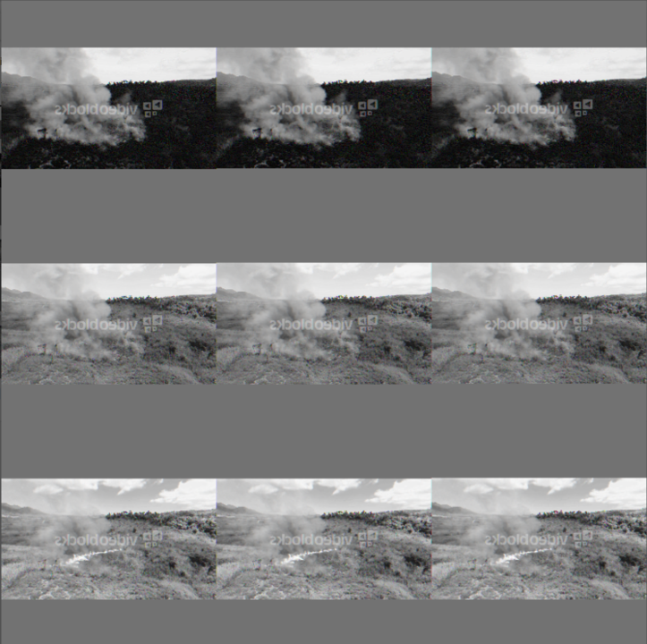

# FireDetection model experimentation

<h2>Training dataset</h2>

It is indeed hard to get images with fires that are about to start. We addressed such problem using crowdsourcing. Using the "similar to" feature on web search engines (yes, the once that starts with G), we looked for videos posted in social channels and drone video platforms containing aereal images of such situations. We used a package on available on Python that will use the similar to feature to download all the videos that match the createria. We preffered the use of videos for building the dataset as from each video we can extract multiple frames. Building up a big data set is affordable and it also contributes to robustness.

<h3>Tagging the dataset</h3>

Tagging was done manually using the VOTT tool for CNTK. We first extracted the frames from the videos and then we tag the the images accordly. The tools allows to export the tagged images for latter use with CNTK or TensorFlow. We used CNTK in this situation.

<h2>Model</h2>

Faster R-CNNs (Region proposals with Convolutional Neural Networks) are a relatively new approach (2015). They have been widely adopted in the Machine Learning community, and now have implementations in most of popular Deep Neural Net frameworks (DNNs) including PyTorch, CNTK, Tensorflow, Caffe, and others.

<h3>Components</h3>

    <ol>
        <li>Localization: An algorithm is used to generate regions of interest (ROI). These region proposals are a large set of bounding boxes spanning the full image. Based on the paper "Segmentation as Selective Search for Object Recognition by Koen E. A. van de Sande, et al.". Implemented in dlib Python library.</li>
	    <li>Object Classification: Visual features are extracted for each of the bounding boxes, they are evaluated and it is determined whether and which objects are present in the proposals based on visual features.
            <ul>
                <li>We use transfer learning with a pretrained image classification models to extract visual features, as these tend to generalize fairly well.</li>
                <li>The representations learned for task A (typically a high-level task) are applied to task B (typically a lower-level task). The degree of success at task B indicates how much the task A model has learned about task B.</li>
                <li>In the processes we take a pre-trained model (AlexNet) and “fine-tuning” the model with our own dataset. The idea is that this pre-trained model will act as a feature extractor. By removing the last layer of the network and replacing it with our own classifier we achieve better performance with less data. Then we freeze the weights of all the other layers and train the network normally.</li>
            </ul>
        </li>
        <li>Non-maximum suppression: Overlapping boxes are combined into a single bounding box. We used Intel Math Library for Python in a C implementation as computing efficiency is critical for speed.</li>
    </ol>

<h3>Representations</h3>

Using TensorBoard we can see the representations learnt by the model. In the following picture it can be seen how the network is able to segregate the fire from the smoke as it goes deeper in the network.

